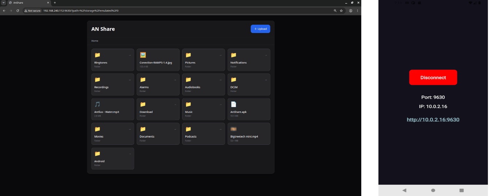

# AnShare
Android File Sharing over Web
 
> This Project is still in beta, There are lots of issues such as slow network speed and etc.

## Demo

I coudn't find an open soruce alternative so decided to start this project. I had to implement the TCP stack from scratch in nodejs but it has produced bottlenech in processing, so I'm trying to implement the network stack in native c.